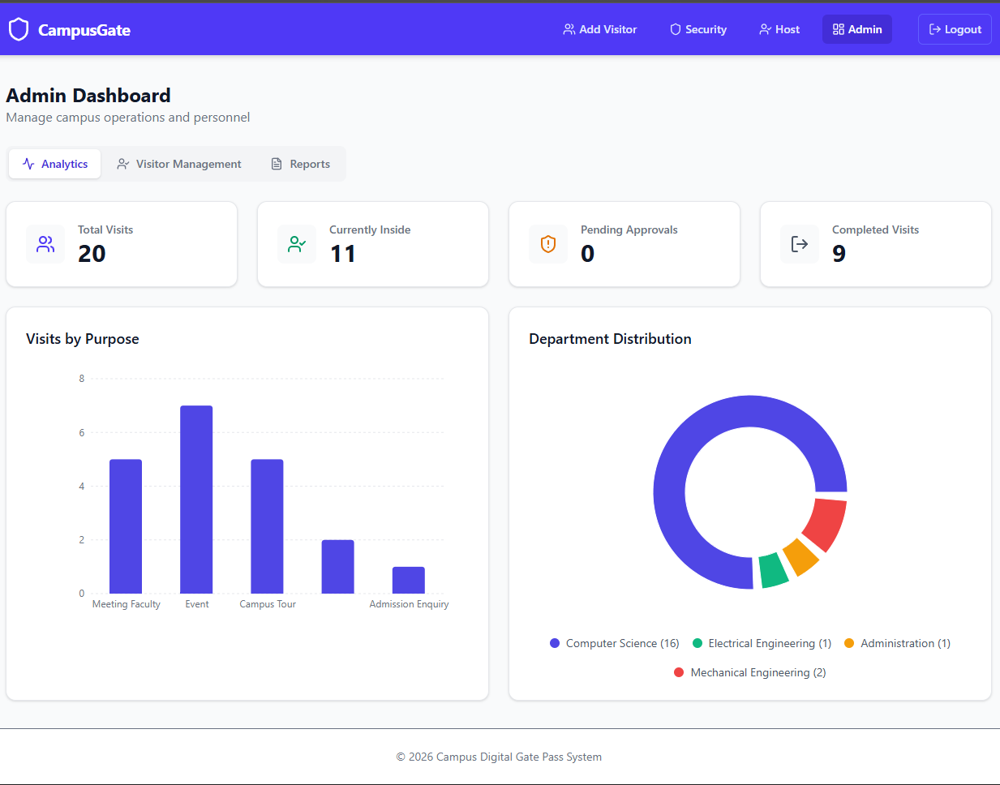
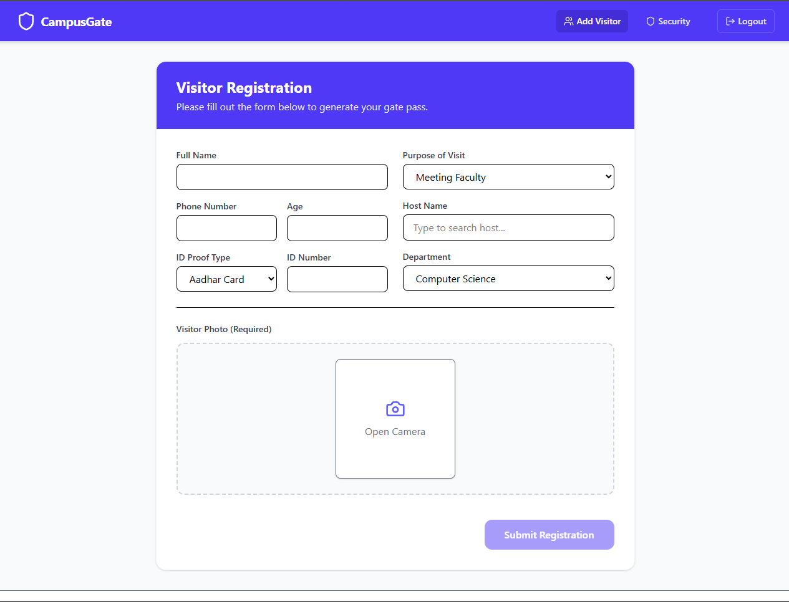
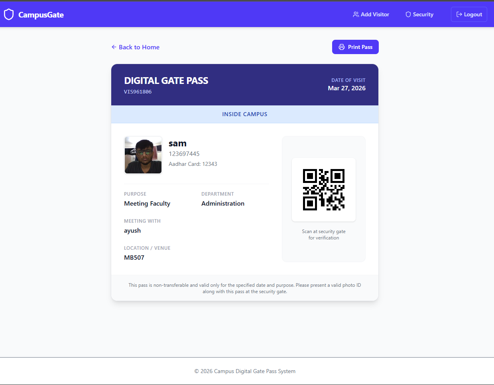

# 🏫 Campus Gate Pass System with Supabase

[](https://react.dev/)
[](https://typescriptlang.org/)
[](https://supabase.com/)
[](https://vitejs.dev/)
[](https://tailwindcss.com/)

A complete **Campus Visitor Management System** for secure gate pass generation, approval workflows, and real-time tracking. Built with modern React + Node.js + Supabase.

## ✨ Features

- **Role-Based Authentication**: Admin, Host, Security, Visitor
- **Visitor Registration**: Webcam photo, ID proof, purpose selection, host assignment
- **Smart Approval Workflow**: Auto-approve common visits (tours/enquiries), manual for others
- **Real-time Tracking**: Pending → Approved → Inside Campus → Completed status
- **Gate Pass Generation**: QR Code + PDF export with visitor details
- **Dashboards & Analytics**:
  - Admin: Full overview, stats, reports
  - Host: Manage their visitors and location
  - Security: Check-in/out, current visitors
- **Reporting**: Charts by purpose/department, exportable reports
- **Mobile-Responsive**: Works on desktop/tablet for security desks

## 🛠️ Tech Stack

| Frontend | Backend | Database | UI/UX | Utils |
|----------|---------|----------|-------|-------|
| React 19 | Express.js | Supabase | Tailwind CSS 4 | Recharts, jsPDF, QRCode |
| TypeScript | Vite + TSX | PostgreSQL | Lucide Icons | Webcam capture, html2canvas |
| React Router | dotenv | Row Level Security | Framer Motion | date-fns |

## 🚀 Quick Start

### Prerequisites
1. **Node.js** 18+ 
2. **Supabase Project**:
   - Create project at [supabase.com](https://supabase.com)
   - Create tables: `users` (id, username, password, role, location), `visitors` (visitor_id, name, phone, age, id_proof_type, id_proof_number, purpose, host_name, department, entry_time, exit_time, status, photo, host_location)
   - Get **Service Role Key** (not anon key!)

### Setup
```bash
# Clone & Install
npm install

# Copy env template
cp .env.example .env.local  # Create this with your Supabase keys

# .env.local required:
# SUPABASE_URL=your_supabase_url
# SUPABASE_SERVICE_ROLE_KEY=your_service_role_key
```

### Run Development Server
```bash
npm run dev
```
Open [http://localhost:3000](http://localhost:3000)

### Build for Production
```bash
npm run build
npm start
```

## 📱 User Roles & Flows

```
Visitor ──(Register)──> Pending ──(Host/Security Approve)──> Approved
                                            │
                                    (Security Check-in) ──> Inside Campus
                                            │
                                    (Security Check-out) ──> Completed
```

| Role | Dashboard Features |
|------|-------------------|
| **Visitor** | Register, View Gate Pass (QR/PDF) |
| **Host** | View assigned visitors, Approve own visitors, Manage profile |
| **Security** | Check-in/out visitors, View active visitors |
| **Admin** | All stats, charts (purpose/dept), Manage hosts |

## 🌐 API Endpoints

| Method | Endpoint | Description |
|--------|----------|-------------|
| `POST` | `/api/login` | Role-based login |
| `POST` | `/api/visitors` | Register new visitor |
| `GET` | `/api/visitors` | List all visitors |
| `PUT` | `/api/visitors/:id/status` | Update status (Approved/Inside/Completed) |
| `GET` | `/api/dashboard/stats` | Dashboard analytics |
| `POST/GET/DELETE` | `/api/users/hosts` | Host management |

## 📁 Project Structure

```
src/
├── components/     # Layout, ProtectedRoute, ReportGenerator
├── context/        # AuthContext
├── pages/
│   ├── admin/      # Admin dashboard
│   ├── host/       # Host dashboard
│   ├── security/   # Security check-in/out
│   └── visitor/    # Register & GatePass
└── App.tsx         # Main app with router
```

## 🖼️ Screenshots





## 🚀 Deployment

### Vercel/Netlify (Frontend + Serverless)
1. Deploy `server.ts` as API route
2. Set Supabase env vars

### Railway/Render (Full server)
```bash
npm run build
npm start
```

## 🔧 Database Schema (Supabase)

```sql
-- Users table
CREATE TABLE users (
  id SERIAL PRIMARY KEY,
  username TEXT UNIQUE NOT NULL,
  password TEXT NOT NULL,
  role TEXT CHECK (role IN ('admin','host','security')) NOT NULL,
  location TEXT
);

-- Visitors table  
CREATE TABLE visitors (
  visitor_id TEXT PRIMARY KEY,
  name TEXT NOT NULL,
  phone TEXT,
  age INTEGER,
  id_proof_type TEXT,
  id_proof_number TEXT,
  purpose TEXT,
  host_name TEXT,
  department TEXT,
  entry_time TIMESTAMPTZ,
  exit_time TIMESTAMPTZ,
  status TEXT CHECK (status IN ('Pending Approval','Approved','Inside Campus','Completed')) DEFAULT 'Pending Approval',
  photo TEXT, -- base64 image
  host_location TEXT
);
```

**Enable RLS** on tables for production.

## 🤝 Contributing

1. Fork & PR
2. `npm run lint` before push
3. Add your screenshots to `/screenshots/`

## 📄 License

MIT - See [LICENSE](LICENSE) (add one!)

---

**Built for secure, scalable campus visitor management** 🚶‍♂️➡️🏫

